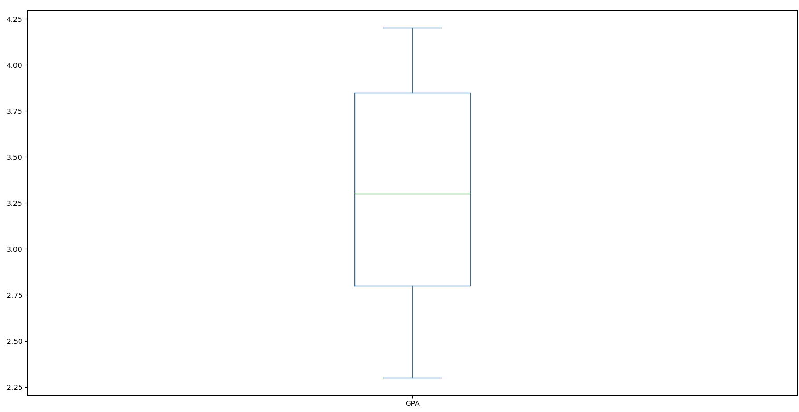
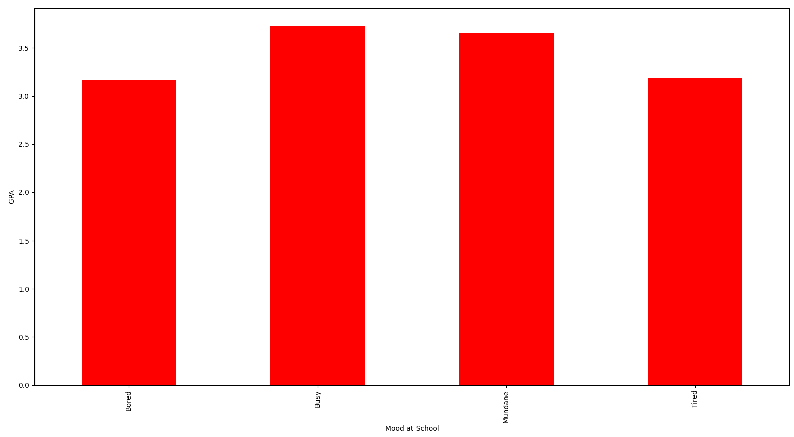
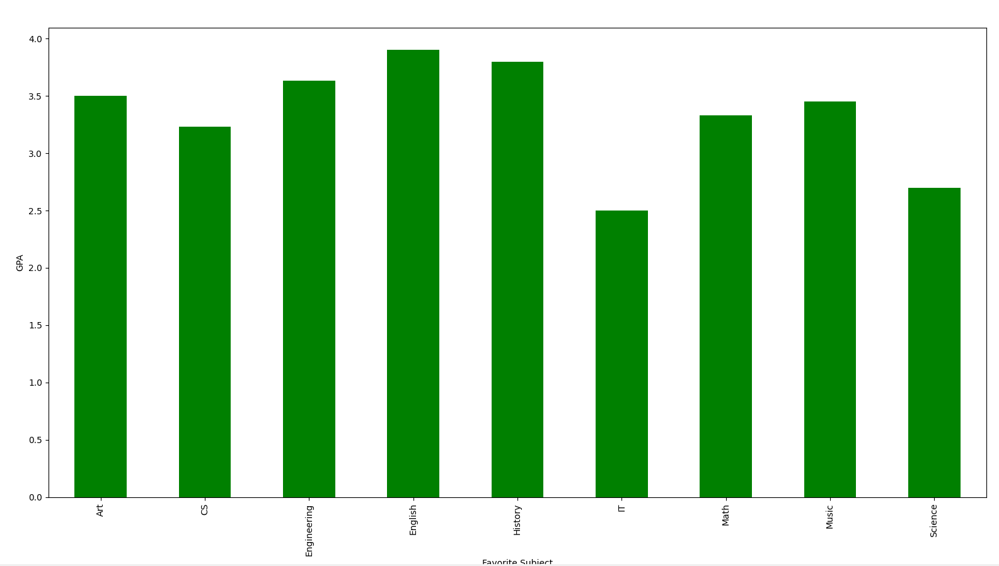
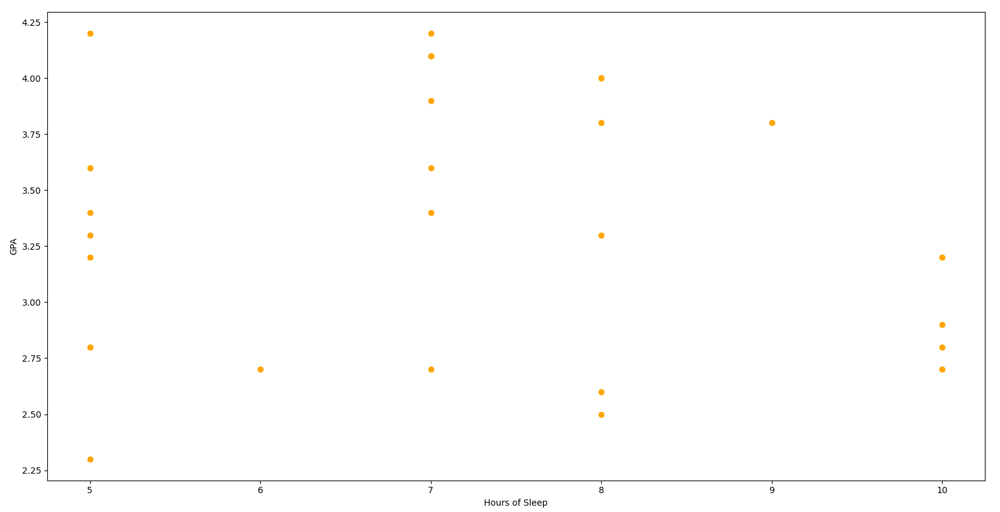
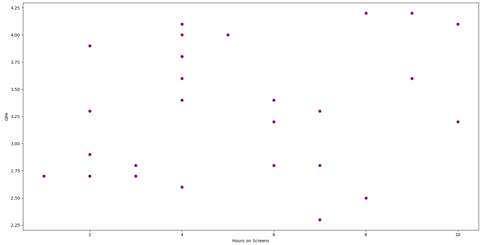

# Project 3 -  Student Submission

## Project Info
- **Project Title:** GPA Analysis by various factors
- **Your Name:** Alexis Luebke
- **Date:** 10/08/2025

---

## Survey Information
- **Survey Topic:** GPA and several minor variables that may or may not affect GPA
- **Survey Link:** [Click here to view survey](https://docs.google.com/forms/d/e/1FAIpQLSfKPH3608lIhK0XIek_L0mhZelqYuEqBPv4e7sTR22uOvEgIA/viewform?usp=dialog)
- **Number of Responses:** 7

---

## Survey Questions
List the questions you asked in your survey and their type:

| # | Question Text | Response Type (Multiple Choice / Numeric / Text) |
|---|---------------|-------------------------------------------------|
| 1 | _How many hours of sleep do you usually get?_ | Numeric |
| 2 | _How many hours do you usually spend on screens per day?_ | Numeric |
| 3 | _What is your favorite subject?_ | Text |
| 4 | _In one word, what is your average mood at school?_ | Text |
| 5 | _What is your average GPA?_ | Numeric |

---

## Data Overview
- **Link to Raw Data File (CSV):** [Download here](survey_data.csv)
- **Number of Columns:** 5
- **Number of Rows:** 27
- **Any Cleaning Steps Taken:** Renamed columns, made text inputs consistent in spelling and capitalization with each other, removed timestamp column.

---

## Charts Created
List each chart you made, its type, and what it shows. Add a link or embed an image if possible.

| # | Chart Title | Chart Type (Bar, Histogram, Scatter, etc.) | Brief Description | Link or Image |
|---|-------------|-------------------------------------------|-------------------|---------------|
| 1 | _GPA_ | Box Chart | Shows min, max, and mean of all GPAs. |  |
| 2 | _Average GPA by Mood_ | Bar Chart | Shows average GPAs for each mood. |  |
| 3 | _Average GPA by Favorite Subject_ | Bar Chart | Shows average GPAs based on the student's favorite subject. |  |
| 4 | _Sleep and GPA_ | Scatterplot | Shows the relationship between hours of sleep and GPA. |  |
| 5 | _Screentime and GPA_ | Scatterplot | Shows the relationship between hours of screentime and GPA. |  |

---

## Data Analysis & Insights
Write a short analysis of your findings. Include at least one interesting insight from your data.

> The average hours of sleep was 7, the average hours of screentime was 5, and the average GPA was 3. However, I don't really think that this data is terribly accurate because
the majority of the data was generated junk data. 

---

## Reflection
Answer briefly:
- What went well in your project? 
mostly everything
- What was the most challenging part?
um probably finding questions, although I don't really think that these ones are that good.
- If you had more time, what would you do differently?
not sure, maybe make the graphs look a bit prettier?

---

### Submission Checklist
- [ ] Link to survey included
- [ ] Questions listed
- [ ] Raw data file attached or linked
- [ ] 3+ charts created and linked/embedded
- [ ] Data analysis section filled in